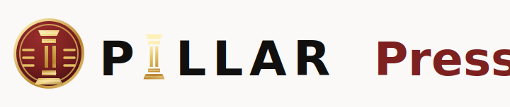

<p align="center">
  
</p>

<p align="center">
  <strong>A local-first desktop app for turning raw ideas, research, and drafts into publication-ready content.</strong>
</p>

<p align="center">
  by
  <a href="https://transformationagency.com">
    
    <strong>Transformation Agency</strong>
  </a>
</p>

<p align="center">
  <a href="https://github.com/Transformation-Agency/pillar-press/releases/download/v0.2.0/Pillar.Press_0.2.0_aarch64.dmg">
    
  </a>
  <a href="https://github.com/Transformation-Agency/pillar-press/releases/download/v0.2.0/Pillar.Press_0.2.0_x64.dmg">
    
  </a>
  <a href="https://github.com/Transformation-Agency/pillar-press/releases/download/v0.2.0/Pillar.Press_0.2.0_x64-setup.exe">
    
  </a>
</p>

<p align="center">
  <a href="#features">Features</a>
  | <a href="#quick-start">Quick Start</a>
  | <a href="docs/setup-guide.md">Setup Guide</a>
  | <a href="docs/release-workflows.md">Releases</a>
  | <a href="#configuration">Configuration</a>
  | <a href="#desktop-app">Desktop App</a>
  | <a href="#security-and-data">Security</a>
</p>

---

## Latest Release

**v0.2.0** is the Pillar Press desktop release with Paul’s updated backend merged into the branded app.

It packages the local-first editorial desk with:

- Desk threads for thinking, drafting, and sending useful responses to Library.
- Library, Book, Weave, Outputs, and Studio workflows for shaping publishable work.
- Cloud and local model setup for OpenAI, Anthropic, Gemini, xAI/Grok, Ollama,
  Docker Model Runner, LM Studio, and OpenAI-compatible endpoints.
- Local SQLite storage, local file exports, and provider settings stored on the
  user's machine.
- Signed release workflows for Apple Silicon Macs, Intel Macs, and Windows.
- Signed in-app updates from GitHub Releases once an updater-enabled build is
  installed.

See all versions on the
[GitHub releases page](https://github.com/Transformation-Agency/pillar-press/releases).

Note: users must already be on an updater-enabled build to update in-app. Older builds that shipped before the updater plugin still need a manual download.

## What It Does

Pillar Press gives you a local editorial workstation for moving from idea to
publication. Capture a thread on the Desk, send the best response to Library,
turn pieces into drafts, run review and revision passes, generate platform
outputs, assemble book chapters, and create supporting media prompts or assets.

It is built for creators, founders, researchers, consultants, and editorial
teams who want AI-assisted content workflows without losing control of their
voice, sources, model choices, or local data.

## Features

- First-run onboarding for voice, writing model setup, audience, throughline,
  and publication preferences.
- Per-thread model selection on the Desk.
- Local-first SQLite storage for campaigns, threads, library items, drafts,
  outputs, model settings, and media metadata.
- OpenAI, Anthropic, Gemini, xAI/Grok, Ollama, Docker Model Runner, LM Studio,
  and OpenAI-compatible model settings.
- Web-aware Desk chat when a configured cloud provider supports hosted web
  search tools.
- Markdown-rendered responses and one-click "Send to Library as Draft".
- Draft, Review, Revision, Outputs, and Media workflow tabs.
- Platform-specific output generation for formats such as Substack, Facebook,
  Instagram, LinkedIn, and X.
- Book workspace with Library-backed chapter creation, chapter deletion,
  drag-and-drop ordering, and file-picker downloads.
- Optional voice read-aloud and audio export using configured voice providers.
- Studio media provider setup for image, voice, and video workflows.
- Signed desktop packaging for macOS and Windows release artifacts.
- In-app update checks from Setup, plus startup and hourly checks while open.

## Quick Start

### Requirements

- Required: Node.js 24 or newer
- Required: npm
- Optional for desktop: Rust and Tauri platform prerequisites
- Optional for local models: Ollama, LM Studio, or Docker Model Runner
- Optional for local speech-to-text: bundled or installed whisper.cpp
- Optional hosted providers: OpenAI, Anthropic, Gemini, xAI/Grok, ElevenLabs,
  and OpenAI-compatible endpoints

### Install

```bash
npm install
cp .env.example .env
npm run dev
```

Open:

```text
http://localhost:3000
```

The onboarding flow will walk you through voice, model, and writing-profile
setup. Leave the legacy `LLM_*` vars in `.env` unset unless you intentionally
want environment variables to override in-app settings.

## Optional System Dependencies

### Desktop Builds

Desktop packaging uses Tauri, which requires Rust and platform build tools.

```bash
curl --proto '=https' --tlsv1.2 -sSf https://sh.rustup.rs | sh
npm install
npm run desktop:dev
```

For full setup instructions, see the
[Tauri prerequisites](https://tauri.app/start/prerequisites/).

### Local Models

Pillar Press can use local OpenAI-compatible model servers.

- Ollama: install from [ollama.com](https://ollama.com), pull a chat model, and
  select it in Setup.
- LM Studio: start the local server and select the detected model in Setup.
- Docker Model Runner: start Docker Desktop's model runner and select the
  detected endpoint in Setup.

### Local Speech-To-Text

For local voice input and offline transcription, Pillar Press can bundle
[whisper.cpp](https://github.com/ggml-org/whisper.cpp). Desktop release
workflows build `whisper-cli` for the target platform and ship the tiny English
model.

For local packaging:

```bash
PILLAR_PRESS_WHISPER_BIN=/path/to/whisper-cli \
PILLAR_PRESS_WHISPER_MODEL=/path/to/ggml-tiny.en.bin \
npm run desktop:prepare-whisper
```

## Configuration

Pillar Press can be configured through the app UI or environment variables.

Common environment variables:

```bash
PILLAR_PRESS_LOCAL_FIRST=true
PILLAR_PRESS_STORAGE=local
PILLAR_PRESS_DATA_DIR=.local-data
OPENAI_API_KEY=
ANTHROPIC_API_KEY=
GEMINI_API_KEY=
XAI_API_KEY=
BRAVE_SEARCH_API_KEY=
```

Credentials entered in the UI are stored in local desktop settings. For
self-hosted or browser development, prefer a private `.env` file that is never
committed.

## Desktop App

The Tauri wrapper packages the local web app, backend, Node runtime, and local
resources into a desktop application.

```bash
npm run desktop:dev
npm run desktop:build
```

Signed and notarized macOS release builds use:

```bash
npm run desktop:build:signed
npm run desktop:verify-signed-release
```

The desktop app stores data in the platform app data directory by default.

## Security And Data

Pillar Press is designed as a local-first desktop app. Sensitive configuration
is stored locally and redacted from local backups where supported.

Do not commit or share:

- `.env`
- `.local-data/`
- `src-tauri/resources/desktop-server/`
- `src-tauri/resources/node/`
- `src-tauri/target/`

Local app data can contain provider API keys, model settings, campaign data,
threads, generated drafts, exported files, media artifacts, and local workflow
state.

## Scripts

```bash
npm run dev
npm run desktop:dev
npm run build
npm run desktop:build
npm run desktop:build:signed
npm run typecheck
npm test
```

## Documentation

- [Setup guide](docs/setup-guide.md)
- [Release workflows](docs/release-workflows.md)
- [Desktop architecture](docs/DESKTOP_LOCAL_FIRST.md)
- [Local development](docs/LOCAL_DEV.md)
- [Data model](docs/DATA_MODEL.md)
- [Gather integration](docs/GATHER_INTEGRATION.md)

## License

MIT. See [LICENSE](LICENSE).
