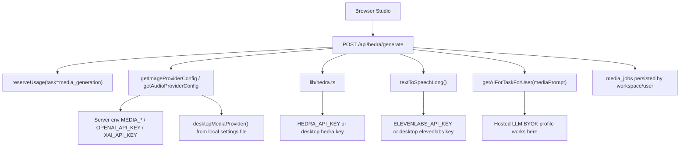

# Hosted Media BYOK Audit

Status: audit complete, settings API implemented, generation resolver not complete.

This audit covers `POST /api/hedra/generate` and the media provider helpers that
power Studio image, audio, video, and avatar generation in hosted web mode.

## Current Verdict

Hosted LLM BYOK is real. Hosted media BYOK is not real yet for generation.

The database can store more than LLM secrets because `provider_secrets.kind` is
generic. Hosted media provider settings now read and write `kind = "media"` via
`GET/PUT /api/media/provider-settings`, but media generation still resolves
provider credentials from server env vars or desktop-local encrypted settings.

## Current Credential Flow

## What Already Works

- Media jobs are persisted with `userId`, `workspaceId`, `campaignId`, and
  `sourceContentId`.
- Media generation reserves hosted usage before provider work.
- Supabase storage uploads reserve hosted storage quota when a hosted user is
  passed through.
- The optional image prompt enhancement now uses `getAIForTaskForUser("mediaPrompt")`,
  so the LLM part of media generation can use hosted LLM BYOK.
- Hosted Hedra credit checks and hosted Eleven/Hedra catalog calls now respect
  managed/BYOK provider access gates before touching platform or user provider
  keys.
- Hosted media provider keys can now be saved as encrypted `provider_secrets`
  rows with `kind = "media"` for `hedra`, `elevenlabs`, `openai`, `xai`, and
  `custom-image`. Browser reads receive only secret-free metadata.

## Gaps

### 1. Hosted media provider secrets are modeled, but not consumed

`lib/mediaProviderSettings.ts` and `GET/PUT /api/media/provider-settings` now
store encrypted hosted media profiles in `provider_secrets.kind = "media"`.

Impact: a hosted user can save Hedra, ElevenLabs, OpenAI media, xAI media, or
custom image provider keys, but generation does not consume those saved keys
yet.

### 2. Media generation does not resolve user-scoped hosted media keys

`lib/mediaProviders.ts` resolves OpenAI/xAI/custom media keys from env vars or
desktop settings:

- `MEDIA_OPENAI_API_KEY` / `OPENAI_API_KEY`
- `MEDIA_XAI_API_KEY` / `XAI_API_KEY`
- `MEDIA_IMAGE_API_KEY`
- encrypted desktop settings via `desktopMediaProvider()`

Hosted `provider_secrets` are not consulted.

Impact: hosted image/audio generation through OpenAI-compatible media providers
is managed-key only in practice.

### 3. Hedra generation cannot accept a user API key

`lib/hedra.ts` supports an override key only for `getCredits()`. The following
generation-critical functions use env/desktop keys only:

- `listModels()`
- `createAsset()`
- `uploadAsset()`
- `generateAsset()`
- `getGenerationStatus()`
- `listAssets()`

Impact: hosted Hedra image/video/avatar generation cannot use a user BYOK Hedra
key yet.

### 4. ElevenLabs generation cannot accept a user API key

`listVoices({ apiKey })` supports BYOK testing, but `textToSpeech()` and
`textToSpeechLong()` do not accept or forward an API key override.

Impact: hosted voice/audio generation and Hedra video voiceover paths cannot use
a user BYOK ElevenLabs key yet.

### 5. Usage ledger cannot distinguish media BYOK from media managed

`reserveUsage()` supports `providerSource`, but media generation currently does
not have a user-scoped media resolver. Reservations therefore still default to
managed unless a route explicitly supplies another source.

Impact: even after media BYOK keys exist, usage events need to mark
`providerSource: "byok"` and include the media profile id to make billing and
support audits accurate.

### 6. `/api/media/providers` is not user-aware

`GET /api/media/providers` reports configured media providers from env/desktop
settings only.

Impact: hosted users will not see their saved media BYOK providers reflected in
Studio capability/status UI.

### 7. Setup still prefers the desktop bridge

The setup helper calls `desktop.saveMediaProviderKey()` in desktop mode. Hosted
web mode now has a matching encrypted settings route, but the setup/onboarding
UI still needs to consistently use it for media provider keys.

Impact: hosted onboarding can test some user-supplied keys and has a route to
persist them, but does not yet reliably feed them into media generation.

## Required Implementation Order

1. Add hosted media provider settings. **Implemented.**
   - Reuse `provider_secrets` with `kind = "media"`.
   - Add schemas for `hedra`, `elevenlabs`, `openai`, `xai`, and
     `custom-image`.
   - Store provider, label, base URL, optional default model ids, and encrypted
     API key.

2. Add server routes for hosted media settings. **Implemented.**
   - Recommended route: `GET/PUT /api/media/provider-settings`.
   - Browser must receive only secret-free metadata.
   - PUT must require authenticated hosted user and BYOK-provider entitlement.

3. Add a user-scoped media resolver.
   - Recommended API:
     `getMediaProviderForUser(provider, capability, user)`.
   - Return `{ config, providerSource, provider, model, profileId }`.
   - Hosted mode should prefer saved BYOK media profile, then managed env only
     when plan allows managed providers.
   - Desktop/local-first should keep env/desktop behavior.

4. Add API-key override support to media clients.
   - `lib/hedra.ts`: add optional `{ apiKey }` to model listing, asset create,
     upload, generation, generation status, asset listing, and asset URL lookup.
   - `lib/elevenlabs.ts`: add `apiKey` to `TtsInput`, `textToSpeech()`, and
     `textToSpeechLong()`.

5. Wire `POST /api/hedra/generate` through the resolver.
   - OpenAI/xAI/custom image path uses hosted BYOK config when selected.
   - OpenAI audio path uses hosted BYOK config when selected.
   - Hedra image/video/avatar path uses hosted BYOK Hedra key when selected.
   - ElevenLabs voiceover paths use hosted BYOK ElevenLabs key when selected.
   - All usage reservations include `providerSource`, `provider`, `model`, and
     `profileId`.

6. Update provider status and setup UI.
   - `GET /api/media/providers` should merge managed availability with
     user-saved hosted media BYOK status.
   - Onboarding/setup should save media keys through the hosted media settings
     route when not running in desktop local-first mode.

7. Add tests.
   - Media settings encryption tests for `kind = "media"`.
   - Route tests proving hosted media generation uses BYOK keys without reading
     env keys.
   - Route tests proving managed media generation requires managed-provider
     access.
   - Route tests proving BYOK media generation requires BYOK-provider access.
   - Regression tests proving secrets never appear in status responses, errors,
     or media job metadata.

## Acceptance Criteria

- A hosted user can add and save a Hedra key, ElevenLabs key, OpenAI media key,
  xAI media key, or custom image provider key without exposing it to the
  browser after save.
- Studio status reflects those saved providers.
- Image generation can run from a hosted user-saved OpenAI/xAI/custom key.
- Audio generation can run from a hosted user-saved OpenAI or ElevenLabs key.
- Hedra image/video/avatar generation can run from a hosted user-saved Hedra
  key.
- Hedra avatar/video voiceover can combine hosted user-saved ElevenLabs and
  Hedra keys.
- Usage events distinguish managed media generation from BYOK media generation.
- Plans can allow BYOK media while denying managed media.
- Desktop/local-first media behavior remains unchanged.
