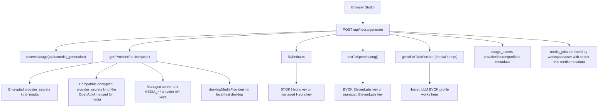

# Hosted Media BYOK Audit

Status: audit complete, hosted media BYOK server plumbing implemented, live provider smoke not complete.

This audit covers Studio media provider settings plus the Hedra/OpenAI-
compatible/ElevenLabs routes that power image, audio, video, and avatar
generation in hosted web mode.

## Current Verdict

Hosted LLM BYOK is real. Hosted media BYOK now has the same encrypted hosted
settings foundation plus server-side generation resolution for Studio media
routes.

The database can store more than LLM secrets because `provider_secrets.kind` is
generic. Hosted media provider settings now read and write `kind = "media"` via
`GET/PUT /api/media/provider-settings`; media generation now prefers saved
hosted BYOK media profiles, then compatible hosted LLM BYOK profiles, and
finally managed env/desktop settings.

## Current Credential Flow

## What Already Works

- Media jobs are persisted with `userId`, `workspaceId`, `campaignId`, and
  `sourceContentId`.
- Media generation reserves hosted usage before provider work.
- Supabase storage uploads reserve hosted storage quota when a hosted user is
  passed through.
- The optional image prompt enhancement now uses `getAIForTaskForUser("mediaPrompt")`,
  so the LLM part of media generation can use hosted LLM BYOK.
- Hosted Hedra credit checks and hosted Eleven/Hedra catalog calls now resolve
  saved media profiles, respect managed/BYOK provider access gates, and avoid
  exposing managed platform credits.
- Hosted media provider keys can now be saved as encrypted `provider_secrets`
  rows with `kind = "media"` for `hedra`, `elevenlabs`, `openai`, `xai`, and
  `custom-image`. Browser reads receive only secret-free metadata.
- `lib/mediaProviders.ts` now resolves hosted media providers per user,
  preferring saved BYOK media profiles, then compatible hosted LLM BYOK
  profiles, and falling back to managed env/desktop settings.
- Compatible hosted LLM BYOK profiles can now satisfy media provider resolution
  without duplicating keys. An OpenAI LLM profile can power OpenAI image/audio
  media routes; an xAI LLM profile can power xAI image routes. Dedicated media
  profiles still win when present.
- `POST /api/hedra/generate` now uses saved BYOK media profiles for OpenAI/xAI
  compatible image generation, OpenAI audio generation, Hedra image/video/avatar
  generation, and ElevenLabs voiceover audio used in Hedra videos.
- Hedra image/video/avatar generation now checks the resolved provider source
  before calling live Hedra model/generation APIs, so hosted BYOK and managed
  media follow the same gate ordering as LLM calls.
- Hedra asset uploads now check the resolved provider source before creating or
  uploading provider assets.
- Hedra model/status/asset operations and ElevenLabs TTS accept per-request API
  key overrides.
- Hedra status polling recovers the saved Hedra profile id from persisted media
  job metadata, verifies that the saved profile is still a Hedra profile, and
  uses that BYOK key for generation status plus asset URL lookup. If the saved
  BYOK profile is missing or points at another provider, the poller returns a
  reconnect error instead of silently falling back to a managed key or sending
  another saved media key to Hedra.
- `GET /api/media/providers` merges managed availability with hosted saved BYOK
  media provider status and compatible hosted LLM BYOK OpenAI/xAI profile
  status.
- Media usage reservations now mark BYOK media generation with
  `providerSource: "byok"` and profile metadata where applicable.
- First-run setup and the full-screen model setup save an OpenAI key as both a
  hosted LLM profile and hosted media/voice profile, so users do not have to
  paste the same OpenAI key twice.
- Studio's provider dialog can add, replace, or remove hosted media keys through
  `/api/media/provider-settings`, with delete operations entitlement-gated and
  audited without secrets.
- Studio's saved media profiles can be tested without re-entering the key:
  Hedra checks credits, ElevenLabs lists voices, and OpenAI/xAI/custom
  OpenAI-compatible media profiles list models through the saved encrypted
  profile.
- `GET /api/media/providers` now returns secret-free provider setup metadata:
  key labels, help URLs, default base URLs, default models, and model
  placeholders. Studio uses that server catalog instead of hard-coded provider
  defaults.
- Hosted BYOK provider base URLs are guarded before save and before live
  test/list/runtime calls: hosted web requires public HTTPS endpoints, rejects
  embedded URL credentials, and refuses localhost, link-local, and private
  network targets. Desktop/local-first remains free to use local providers such
  as Ollama or Docker Model Runner.

## Gaps

### 1. Live provider smoke coverage is still needed

Automated tests prove resolver behavior, secret-free responses, and BYOK usage
reservation shape. They do not prove live provider behavior against Hedra,
ElevenLabs, OpenAI image/audio, xAI image, and custom image endpoints.

Impact: before launch, run a hosted staging smoke with real BYOK keys for each
supported provider and confirm generated assets persist beyond signed provider
URL expiry.

### 2. Hosted media provider management still needs live polish

First-run setup and Studio now write hosted media keys through the encrypted
settings route, Studio can remove saved profiles, and saved profiles can be
tested without exposing keys. The provider catalog now exposes setup help and
default model/base URL metadata. A production SaaS should still refine provider
copy and model recommendations as vendor APIs change.

Impact: hosted BYOK media can be configured without env vars, but the management
experience still needs live-provider validation before broad self-serve launch.

## Required Implementation Order

1. Add hosted media provider settings. **Implemented.**
   - Reuse `provider_secrets` with `kind = "media"`.
   - Add schemas for `hedra`, `elevenlabs`, `openai`, `xai`, and
     `custom-image`.
   - Store provider, label, base URL, optional default model ids, and encrypted
     API key.

2. Add server routes for hosted media settings. **Implemented.**
   - Recommended routes: `GET/PUT/DELETE /api/media/provider-settings` and
     `POST /api/media/provider-settings/test`.
   - Browser must receive only secret-free metadata.
   - PUT and DELETE must require authenticated hosted user and BYOK-provider
     entitlement.
   - Saved-profile tests must require authenticated hosted user and
     BYOK-provider entitlement before touching a user key.

3. Add a user-scoped media resolver. **Implemented.**
   - Recommended API:
     `getMediaProviderForUser(provider, capability, user)`.
   - Return `{ config, providerSource, provider, model, profileId }`.
   - Hosted mode should prefer saved BYOK media profile, then compatible hosted
     LLM BYOK profile for OpenAI/xAI media, then managed env only when plan
     allows managed providers.
   - Desktop/local-first should keep env/desktop behavior.

4. Add API-key override support to media clients. **Implemented.**
   - `lib/hedra.ts`: add optional `{ apiKey }` to model listing, asset create,
     upload, generation, generation status, asset listing, and asset URL lookup.
   - `lib/elevenlabs.ts`: add `apiKey` to `TtsInput`, `textToSpeech()`, and
     `textToSpeechLong()`.

5. Wire `POST /api/hedra/generate` through the resolver. **Implemented.**
   - OpenAI/xAI/custom image path uses hosted BYOK config when selected.
   - OpenAI audio path uses hosted BYOK config when selected.
   - Hedra image/video/avatar path uses hosted BYOK Hedra key when selected.
   - ElevenLabs voiceover paths use hosted BYOK ElevenLabs key when selected.
   - All usage reservations include `providerSource`, `provider`, `model`, and
     `profileId`.
   - Queued Hedra jobs persist secret-free `hedraProfileId` metadata so later
     status polling and asset URL resolution continue through the same hosted
     BYOK Hedra profile.

6. Update provider status and setup UI. **Started.**
   - `GET /api/media/providers` should merge managed availability with
     user-saved hosted media BYOK status. **Implemented.**
   - Onboarding/setup should save media keys through the hosted media settings
     route when not running in desktop local-first mode. **Implemented.**
   - Studio should list and remove saved hosted media profiles without exposing
     keys. **Implemented.**
   - Studio should test saved hosted media profiles without asking the user to
     paste the key again. **Implemented.**
   - Studio should receive provider help, model placeholders, and base URL
     defaults from the secret-free server catalog. **Implemented.**

7. Add tests. **Started.**
   - Media settings encryption tests for `kind = "media"`.
   - Route tests proving hosted media generation uses BYOK keys without reading
     env keys.
   - Route tests proving managed media generation requires managed-provider
     access.
   - Route tests proving BYOK media generation requires BYOK-provider access.
   - Route tests proving Hedra model and credit lookups use saved hosted BYOK
     keys only after BYOK access is allowed.
   - Route tests proving saved hosted media profiles can be tested without
     returning raw keys.
   - Route tests proving Hedra status polling uses the persisted BYOK Hedra
     profile id for status and asset URL lookup.
   - Regression tests proving secrets never appear in status responses, errors,
     or media job metadata.
   - Hosted provider URL guard tests proving hosted media/LLM settings cannot
     persist localhost, private-network, non-HTTPS, or credentialed base URLs.

## Acceptance Criteria

- A hosted user can add and save a Hedra key, ElevenLabs key, OpenAI media key,
  xAI media key, or custom image provider key without exposing it to the
  browser after save.
- A hosted user can remove a saved media provider profile without exposing the
  key and without touching other users or workspaces.
- A hosted user can test a saved media provider profile without re-pasting the
  key or exposing it to the browser.
- Studio status reflects those saved providers.
- Studio status reflects compatible saved OpenAI/xAI LLM profiles as media
  capable, without returning raw keys.
- Image generation can run from a hosted user-saved OpenAI/xAI/custom key.
- Audio generation can run from a hosted user-saved OpenAI or ElevenLabs key.
- Image/audio generation can reuse compatible hosted OpenAI/xAI LLM BYOK keys
  when a dedicated media key has not been saved.
- Hedra image/video/avatar generation can run from a hosted user-saved Hedra
  key.
- Hedra status polling for queued image/video/avatar jobs continues to use the
  same hosted user-saved Hedra key selected at generation time.
- Hedra avatar/video voiceover can combine hosted user-saved ElevenLabs and
  Hedra keys.
- Follow-up audit update: profile ids now propagate to the non-generate media
  edges too. Hedra model listing, Hedra credit checks, Hedra asset uploads, and
  ElevenLabs voice listing all accept `mediaProfileId`/`profileId` so a hosted
  BYOK user can target the selected encrypted profile instead of silently using
  the workspace's first provider profile or managed env key. Video/avatar
  generation also accepts `audioMediaProfileId` so Hedra rendering and
  generated voiceover audio can use different explicit BYOK profiles.
- Usage events distinguish managed media generation from BYOK media generation.
- Plans can allow BYOK media while denying managed media.
- Desktop/local-first media behavior remains unchanged.
- Hosted custom/OpenAI-compatible media endpoints must be public HTTPS provider
  endpoints; local/private endpoints are supported only by the desktop/local-
  first runtime.
