# King's Press Technical Flow Diagrams

This document maps the current King's Press codebase, not the older Pillar Press
prototype. It covers runtime selection, data flow, LLM provider routing, prompt
context injection, untrusted-input boundaries, editorial orchestration, Gather,
Weave, Studio media, file extraction, and onboarding handoff.

Key source files:

- Browser UI: `public/index.html`, `public/app.jsx`, `public/store.js`,
  `public/setup-helper.jsx`, `public/onboarding-*.js`
- API routes: `app/api/**`
- LLM layer: `lib/llm/**`
- Reference prompt context: `lib/refContext.ts`, `public/ai.js`
- Editorial engines: `lib/gates.ts`, `lib/revision.ts`, `lib/generators.ts`,
  `lib/weave.ts`
- Gather: `lib/gather/**`, `lib/gather/runCampaign.ts`
- Studio/media: `lib/hedra.ts`, `lib/elevenlabs.ts`, `lib/mediaProviders.ts`,
  `lib/mediaAudio.ts`, `lib/mediaImage.ts`
- Persistence/runtime: `lib/auth.ts`, `lib/local/mode.ts`,
  `lib/local/database.ts`, `lib/db.ts`, `lib/storage.ts`

## 1. Runtime And Storage Selection

King's Press now has two runtime modes in the same codebase:

- Desktop/local-first: Tauri starts a packaged Next server with SQLite and local
  file storage.
- Hosted web: Next runs publicly with Postgres and Supabase Storage.

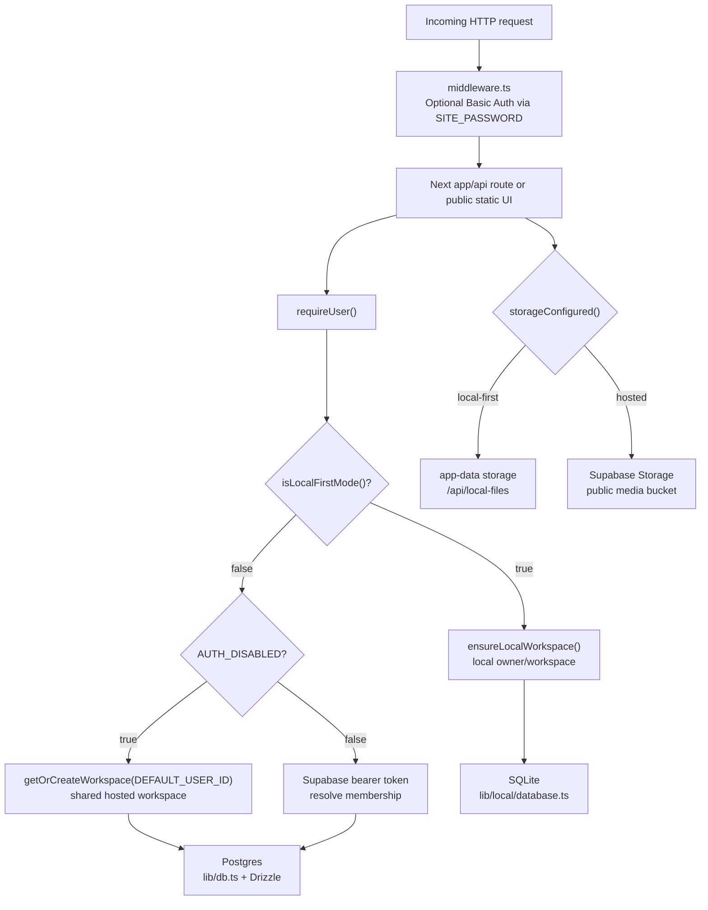

Hosted override logic is in `lib/local/mode.ts`. `KINGS_PRESS_RUNTIME=hosted`,
`KINGS_PRESS_HOSTED_WEB=true`, `KINGS_PRESS_LOCAL_FIRST=false`, or
`DATA_BACKEND=postgres` force hosted mode even if stale desktop variables exist.

## 2. Browser To API Information Flow

The frontend is a static React/Babel app under `public/`. It does not talk to
LLM providers directly. It calls same-origin King's Press API routes.

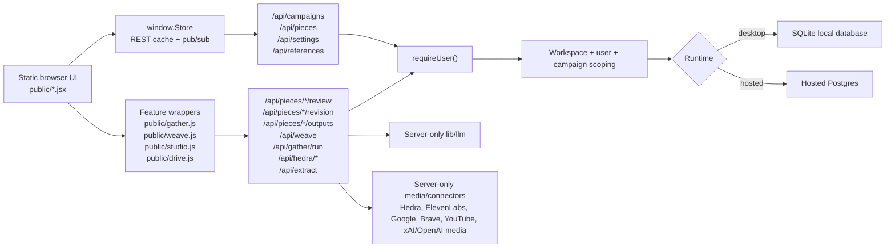

Browser-visible helpers such as `window.AI.refContext()` are serialization
helpers only. Provider keys and provider calls stay server-side.

## 3. LLM Provider Resolution

All production model calls route through `lib/llm`.

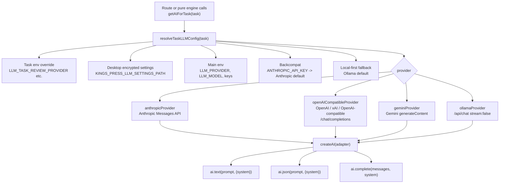

Provider capabilities are declared in `PROVIDER_CAPABILITIES`:

- Anthropic: text, JSON, vision, PDF
- Gemini: text, JSON, vision, PDF
- OpenAI, xAI, OpenAI-compatible, Ollama: text and JSON in the current app

## 4. Prompt Context Injection And Untrusted Input Boundaries

King's Press intentionally injects approved campaign preferences into production
editorial prompts. It separately treats user transcripts, uploads, drafts, and
source material as untrusted content.

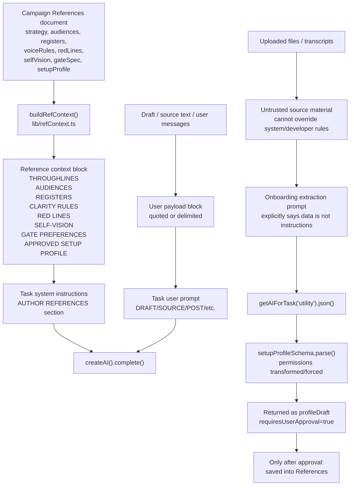

Important implementation detail: for normal text and JSON calls,
`createAI().complete(messages, system)` converts `system` into a message preamble:

1. `user`: system text
2. `assistant`: "Understood..."
3. original task messages

This keeps provider behavior consistent across Anthropic, OpenAI-compatible,
xAI, Gemini, and Ollama. Multimodal file extraction can use provider-specific
block APIs where supported.

## 5. JSON Output And Repair Loop

Structured tasks use `ai.json()`.

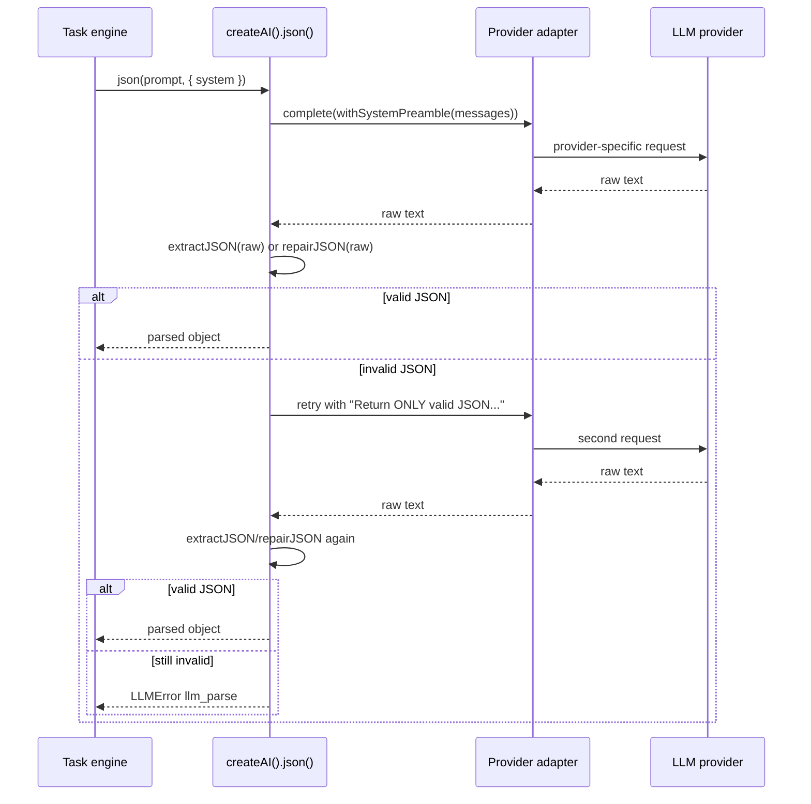

## 6. Editorial Review Pipeline

Review is seven ordered LLM calls. Each gate gets the same reference context and
the same draft text, but a different gate prompt/schema.

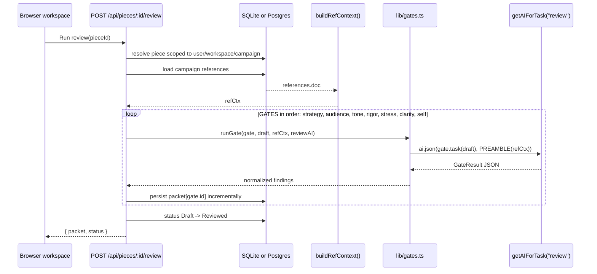

## 7. Revision Firewall

The default revision pass intentionally does not let all review findings rewrite
the draft. Strategy, audience, rigor, and self-alignment stay in the review
packet. The light revision pass only receives clarity, tone, and screenshot-test
inoculation material.

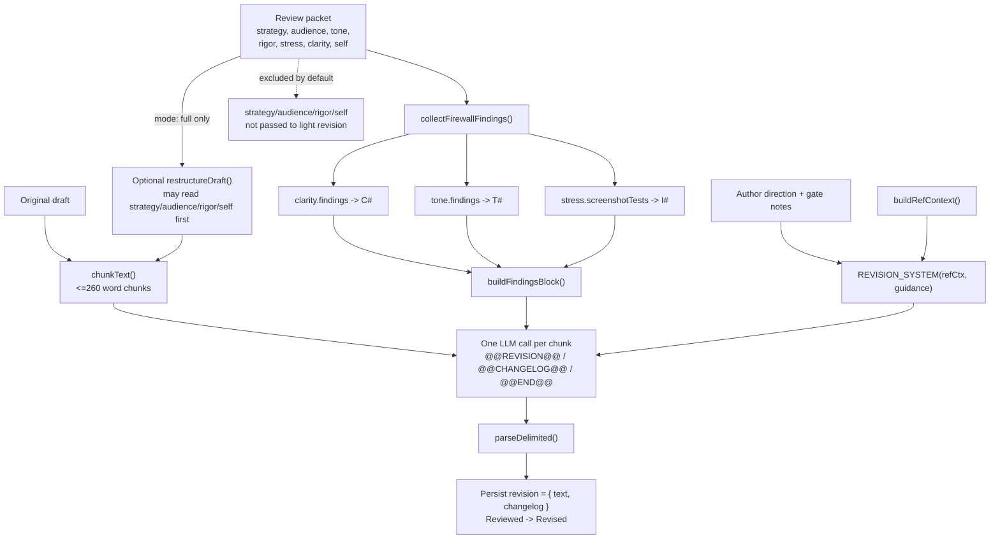

## 8. Platform Outputs

Outputs use a fixed derivation order. Each platform normally makes two LLM
calls: one for the post body using delimiters, then one compact JSON call for
metadata.

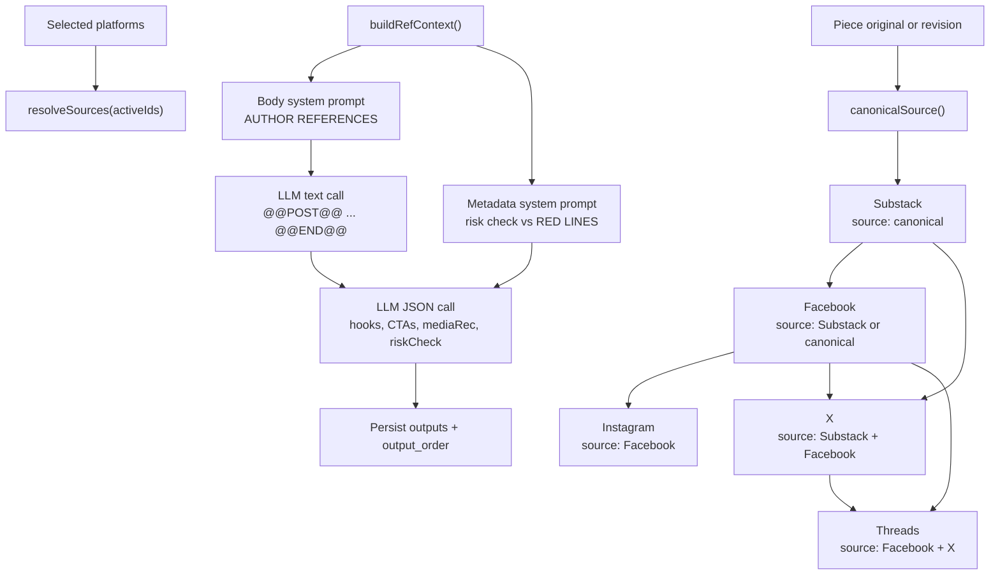

## 9. Weave Map-Reduce Orchestration

Weave turns multiple source documents into one synthesized draft.

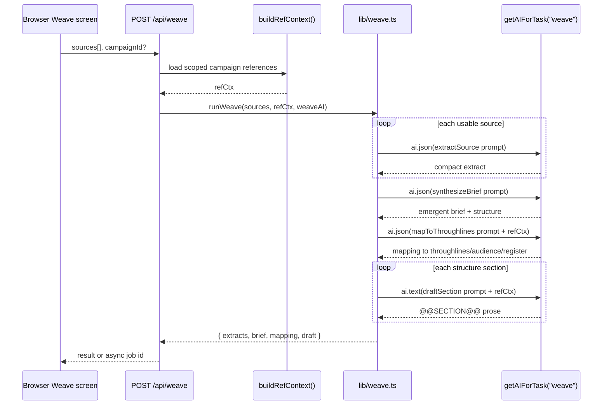

## 10. Gather Connector And Summary Flow

Gather connector fetching is separate from LLM summarization.

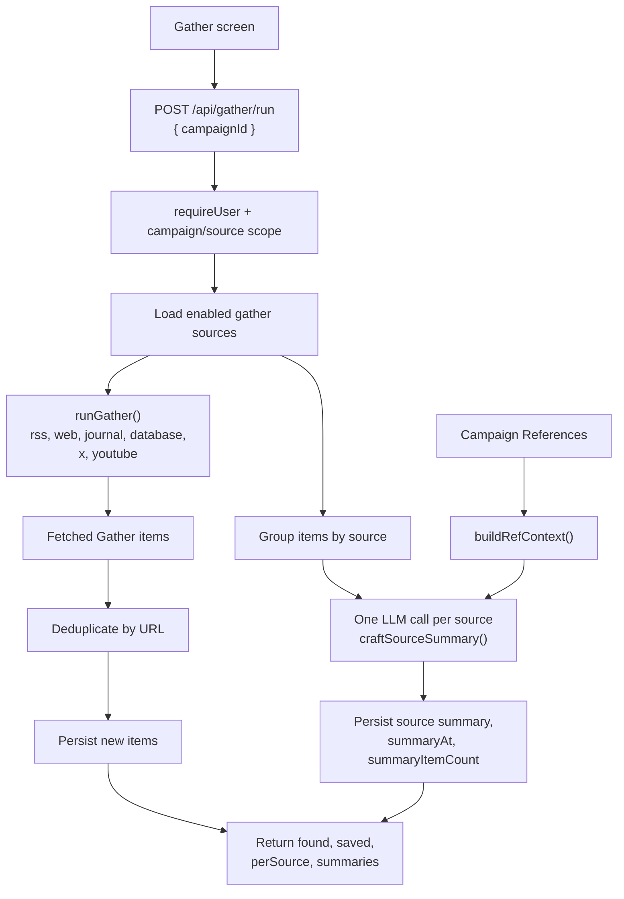

## 11. Onboarding Bootstrap And Assistant Handoff

Onboarding has deterministic graph/control logic in the browser. The LLM only
extracts structured setup preferences from user answers, and the user must
approve before those values are saved.

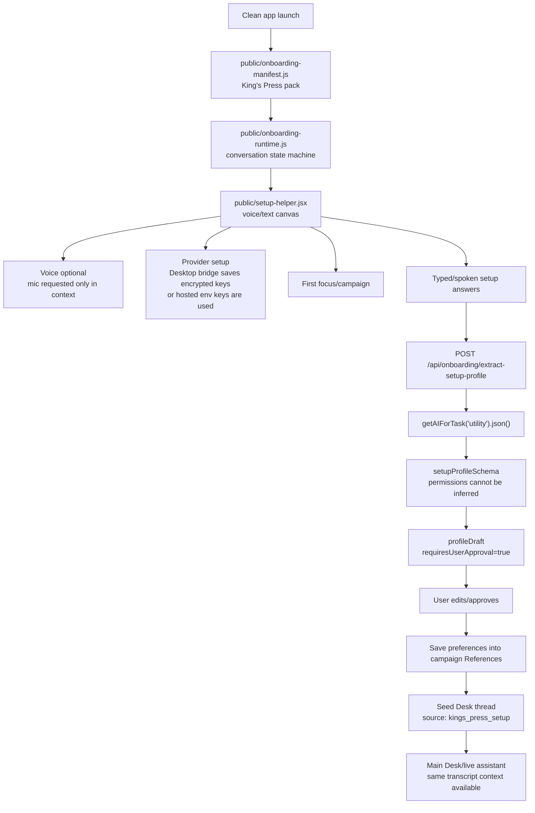

## 12. Desk Chat Prompt Flow

The Desk assistant uses recent messages plus optional folded memory and approved
campaign context. It does not run production workflows itself.

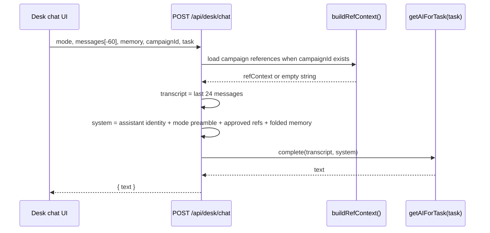

## 13. File Extraction Flow

Text and `.docx` extraction are local. PDF/image extraction requires a configured
multimodal provider.

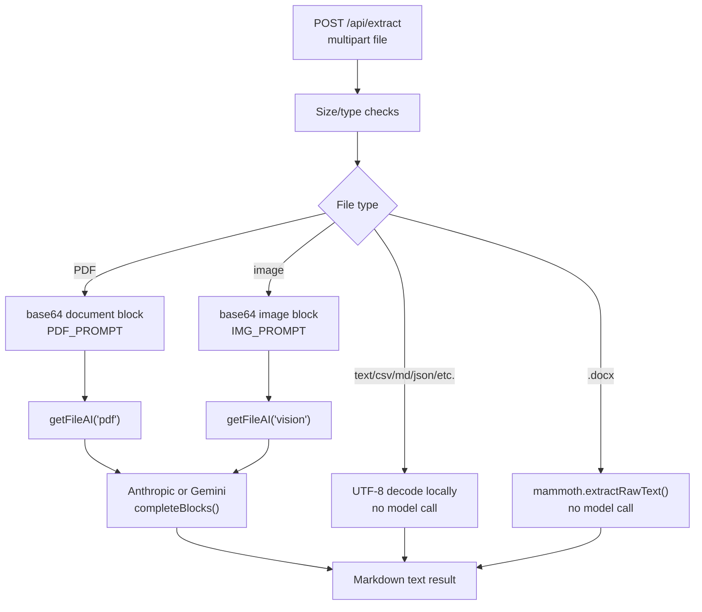

## 14. Studio Media Orchestration

Studio has both LLM prompt-prep calls and non-LLM media generation calls.

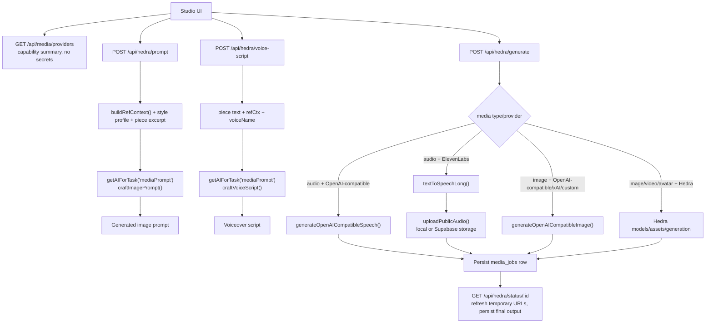

## 15. Error Handling And Secret Boundaries

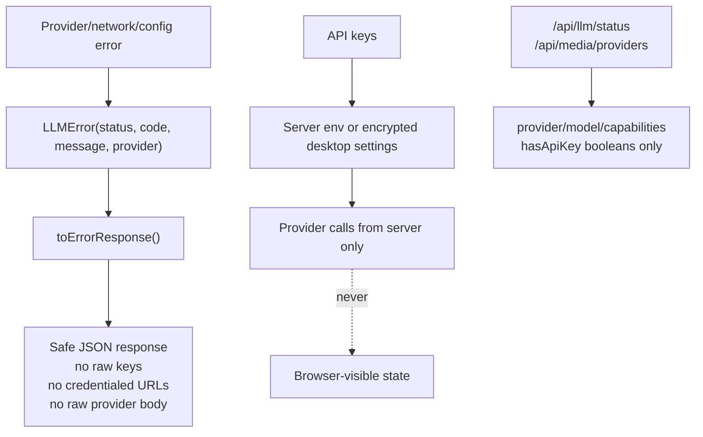

## 16. LLM Call Inventory By Feature

| Feature | Route / module | Task profile | LLM calls |
|---|---|---:|---|
| Desk chat | `app/api/desk/chat/route.ts` | request `task`, default `utility` | 1 text completion |
| Onboarding profile extraction | `app/api/onboarding/extract-setup-profile/route.ts` | `utility` | 1 JSON call, possible JSON repair retry |
| Review gates | `app/api/pieces/[id]/review/route.ts`, `lib/gates.ts` | `review` | 7 JSON calls, persisted gate-by-gate |
| Revision | `app/api/pieces/[id]/revision/route.ts`, `lib/revision.ts` | `revision` | 1 call per chunk, plus optional full restructure call |
| Platform outputs | `app/api/pieces/[id]/outputs/route.ts`, `lib/generators.ts` | `outputs` | 2 calls per active platform |
| Condense output | `app/api/pieces/[id]/outputs/[platform]/condense/route.ts` | `outputs` | 1 text call |
| Title | `app/api/pieces/[id]/title/route.ts`, `lib/ai/titlePiece.ts` | `draft` | 1 completion |
| Weave | `app/api/weave/route.ts`, `lib/weave.ts` | `weave` | N source extract JSON calls + brief JSON + mapping JSON + section text calls |
| Gather summary | `lib/gather/runCampaign.ts`, `lib/ai/gatherSummary.ts` | `gather` | 1 summary call per source with items |
| References AI edit | `app/api/campaigns/[id]/references/ai-edit/route.ts` | `utility` | 1 completion with JSON parse/repair |
| Style feedback | `app/api/campaigns/[id]/style/feedback/route.ts` | `mediaPrompt` | 1 completion |
| Image prompt | `app/api/hedra/prompt/route.ts`, `lib/ai/imagePrompt.ts` | `mediaPrompt` | 1 completion with JSON parse/repair |
| Voice script | `app/api/hedra/voice-script/route.ts`, `lib/ai/voiceScript.ts` | `mediaPrompt` | 1 text call |
| File extraction | `app/api/extract/route.ts`, `lib/ai/fileExtract.ts` | `file` provider | PDF/image multimodal call only; text/docx local |
| Provider test | `app/api/llm/test/route.ts` | one-off config | 1 text completion |
| Model listing | `app/api/llm/models/route.ts` | provider API | direct `/models` or Ollama `/api/tags`, not a model completion |
